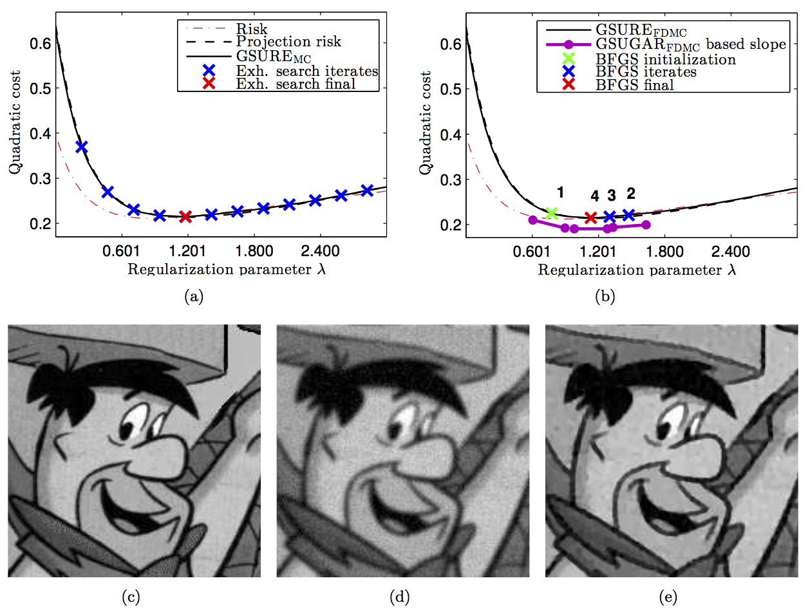

This Matlab package contains the source code to reproduce the figure of the article

C. Deledalle, S. Vaiter, G. Peyré, J. Fadili. [Stein Unbiased GrAdient estimator of the Risk (SUGAR) for multiple parameter selection](http://hal.archives-ouvertes.fr/hal-00987295). SIAM Journal on Imaging Sciences, 7(4), pp. 2448–2487, 2014.

Copyright (c) 2014 Charles Deledalle
